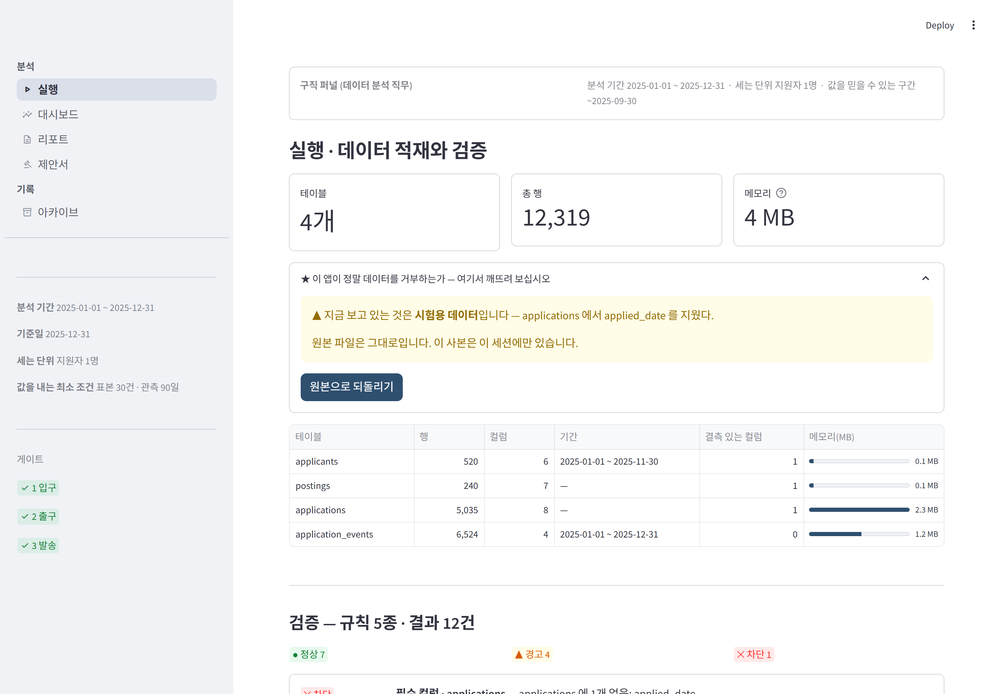
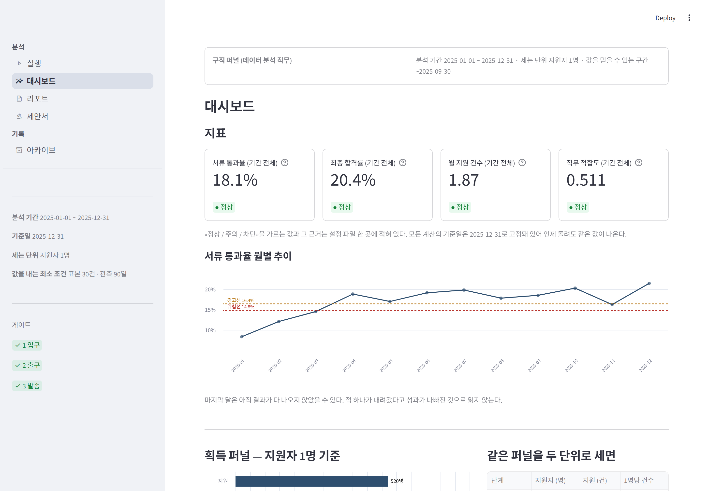
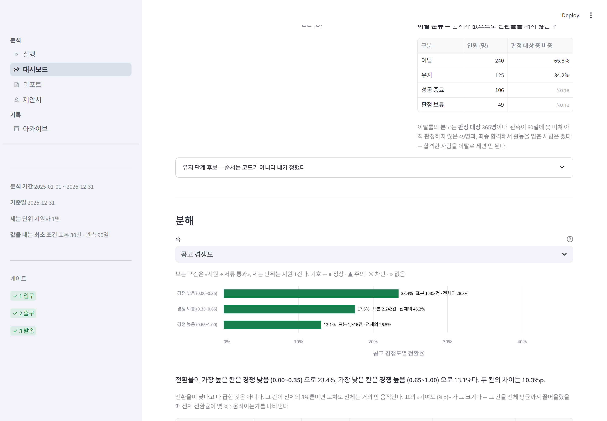
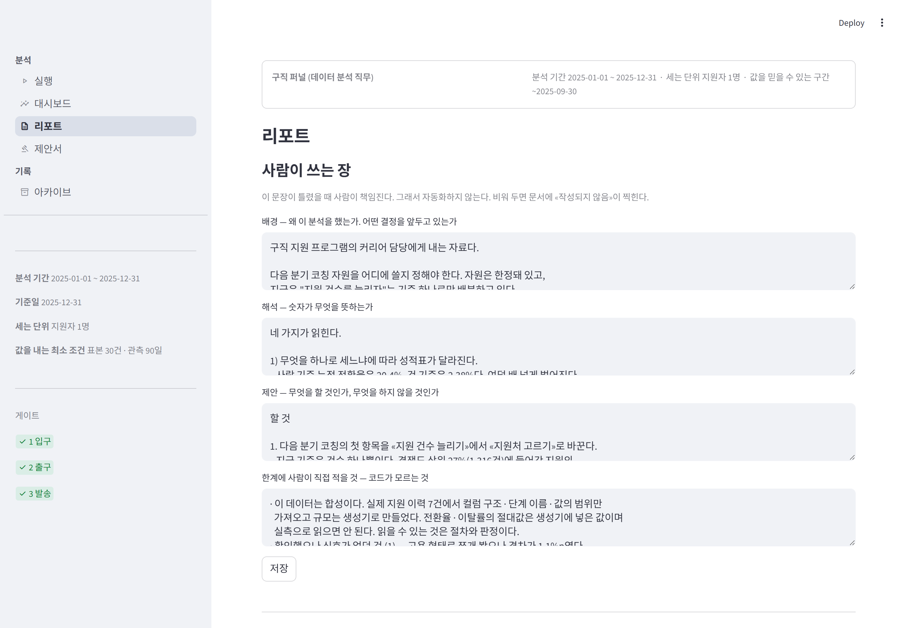
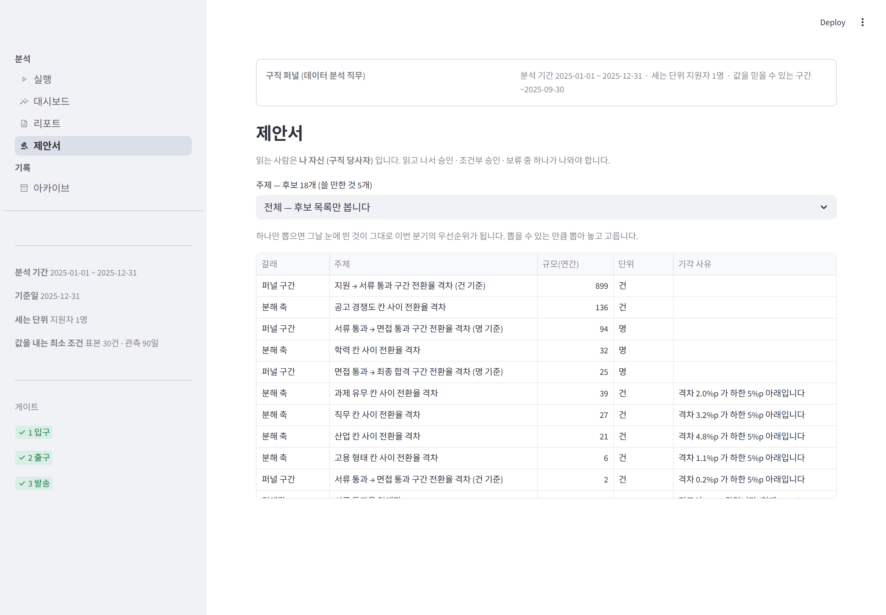
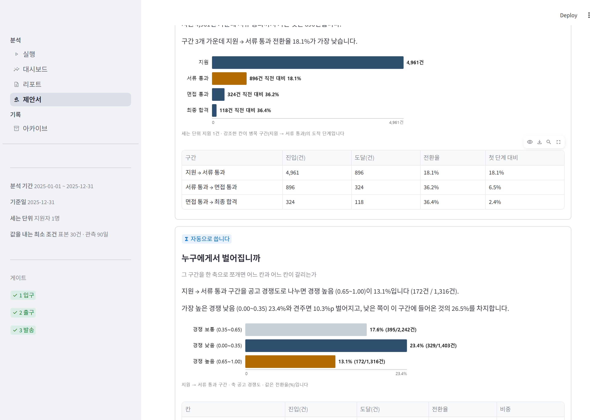
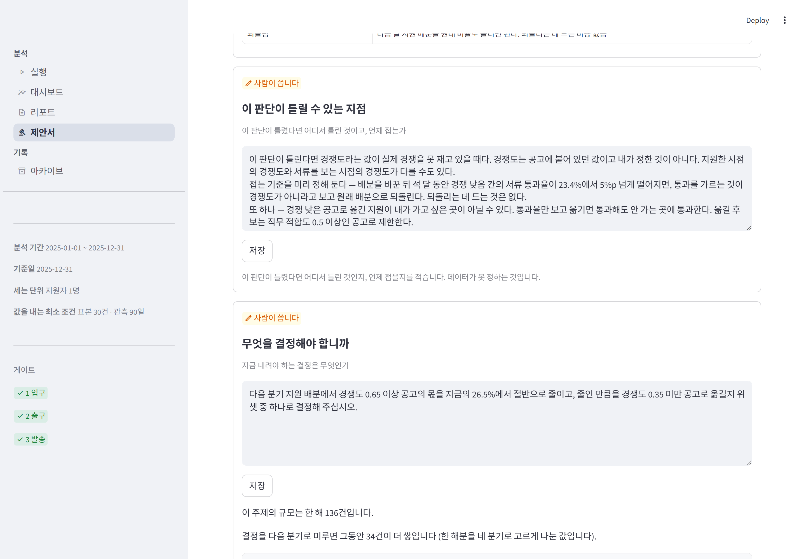
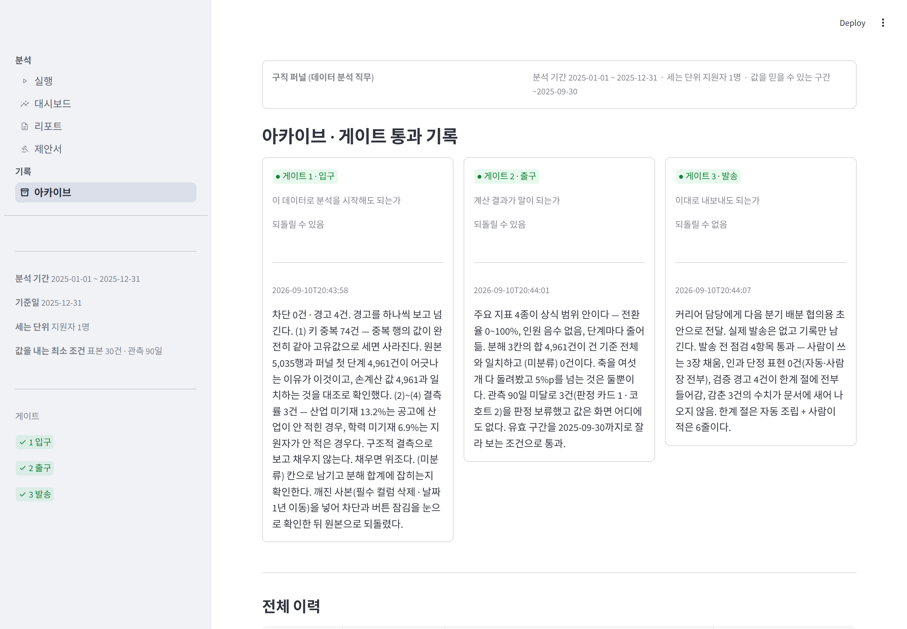

# my-report — 8주차에 만든 내 앱

7주차에 손으로 하던 분석을 앱이 하게 만든 것이다.
데이터는 `../mydomain/` 의 **구직 퍼널**(데이터 분석 직무)을 그대로 가져왔다.
교안 본문은 통신사지만, 자기 도메인이 있으면 〖 내 도메인이라면 〗 박스대로 한다.

> ⚠ **이 데이터는 합성이다.** 실제 지원 이력 7건에서 컬럼 구조 · 단계 이름 ·
> 값의 범위만 가져오고 규모는 생성기로 만들었다. 전환율 · 이탈률의 **절대값은
> 생성기에 넣은 값**이며 실측으로 읽으면 안 된다.
> 이 프로젝트의 값어치는 숫자가 아니라 **무엇을 어떤 근거로 판정했는가**에 있다.

## 실행

```bash
cd my-report
pip install -r requirements.txt
streamlit run app.py
```

사이드바에 **실행 · 대시보드 · 리포트 · 아카이브** 네 화면이 있다.
게이트 1을 통과해야 대시보드가, 게이트 2를 통과해야 리포트가 열린다.
실행 화면에 **«이 앱이 정말 데이터를 거부하는가»** 자리가 있다.
버튼 하나로 필수 컬럼을 지우거나 날짜를 옮긴 사본을 넣어 차단이 뜨는 것을
직접 볼 수 있고, 직접 만든 파일을 올려도 된다.
사본은 그 세션에만 있고 `data/` 의 원본은 건드리지 않는다.

안 지난 화면은 메뉴에 자물쇠가 붙는다 — 목록에서 빼지는 않는다.
있다는 것은 보이되 왜 잠겼는지 말해 주는 쪽이 낫고, 확인 스크립트도 그 화면을 연다.

한글 폰트는 저장소에 넣지 않았다. Windows 는 설치된 맑은 고딕을,
배포처(리눅스)는 `packages.txt` 가 깔아 주는 나눔고딕을 쓴다 (`fonts/README.md`).

## 화면

사진은 `python checks/shots.py` 가 **실제 브라우저로** 찍는다. 손으로 캡처하지 않는다 —
화면을 고치면 사진도 같이 낡는데, 낡은 사진은 틀린 설명과 같다.

### 실행 — 이 앱이 정말 데이터를 거부하는가



버튼 하나로 원본의 **사본**을 망가뜨려 넣는다. 차단이 뜨고 통과 버튼이 잠긴다.
`data/` 의 원본은 건드리지 않고, 사본은 그 세션에만 있다.

### 대시보드 — 지표와 월별 추이



큰 숫자는 기간 전체 값이다. 옆에 «전월 대비» 화살표를 붙였다가 뺐다 —
기준이 다른 두 숫자를 붙여 놓으면 «18.1%가 5.2%p 올랐다»로 읽힌다.
추이는 밑의 그림이 기준을 밝히고 보여 준다.

### 대시보드 — 분해



### 리포트 — 사람이 쓰는 장과 인과 표현 검사



### 제안서 — 주제 후보. 기각된 것도 목록에 남는다



### 제안서 — 고른 주제로 조립된 절



### 제안서 · 요청 — 결정 선택지 셋과 마지막 줄



### 아카이브 — 게이트 통과 기록




## 4일치 확인을 한 번에

```bash
python checks/run_all.py
```

| 확인 | 무엇을 보는가 |
| --- | --- |
| `day1_break.py` | 깨진 파일을 넣으면 차단이 뜨고 통과 버튼이 잠기는가 |
| `sandbox_break.py` | **화면의 «깨뜨려 보기» 버튼**을 실제로 눌러 차단이 뜨는가 · 원본 파일이 안 바뀌는가 |
| `day2_crosscheck.py` | 앱의 숫자가 7주차 손계산과 같은가 (11항목) |
| `day3_trust.py` | 감춘 항목에 값이 없는가 · 판정 7분기가 다 도는가 |
| `day4_phrasing.py` | 인과 표현을 일부러 넣으면 잡히고, 되돌리면 사라지는가 |
| `run_gates.py` | 게이트 1→2→3 을 실제 화면에서 눌러 통과 · PDF 생성 |
| `ui_smoke.py` | 4개 화면이 에러 없이 열리는가 |
| `shots.py` | 실제 브라우저(Playwright)로 네 화면을 찍는다 — 잘림·겹침은 렌더 트리로 안 보인다 |
| `app_audit.py` | 규칙 15개를 앱이 실제로 지키는가 (`/앱점검` 의 기계 점검부) |
| `w9d1_evidence.py` | 9주차 Day1 — 근거로 쓸 숫자를 **함수 직접 호출로** 조회한다 (화면은 반올림돼 있고 분모가 안 보인다) |
| `w9d1_verify.py` | `발견.md` 의 숫자 51개가 지금 조회값과 같은가 + 발견에 원인이 섞였는가 |
| `w9d3_proposal.py` | 9주차 Day3 — 제안서 자가 검사. 빈칸 · 정체불명 용어 · 문장 없는 그림 · 마지막 줄의 결정 동사 · 절 개수, 그리고 Day2 의 자동/사람 분리까지 (34항목) |

확인은 `streamlit.testing.v1.AppTest` 로 **실제 Streamlit 런타임**을 띄워
버튼을 누른다. 흉내낸 객체가 아니다.

## 구조

```
my-report/
├── app.py                   메뉴만 만든다 (st.navigation). 화면은 screens/ 가 그린다
├── CLAUDE.md                ★ 지킬 것 스무 개 + 제안서 절 구조표 — 다음 프로젝트로 간다
├── core/
│   ├── config.py            ★ 값을 고칠 일이 있으면 여기 하나만 — 단계·기간·임계값·색
│   ├── loader.py            적재. csv 는 UTF-8 → cp949 순으로 시도
│   ├── shell.py             네 화면이 공유하는 껍데기 — 적재·상단바·게이트 잠금
│   ├── validate.py          검증 규칙 5종(차단 3 · 경고 2) · 참고 12건은 아래쪽에
│   ├── metrics.py           퍼널 · 유지 · 지표 · 분해 · 못 믿을 조건
│   ├── verdict.py           판정 순서를 코드로 박은 자리
│   ├── context.py           화면과 문서가 같은 값을 쓰게 하는 자리 · 검산 셋
│   └── gates.py             게이트 1·2·3 기록 (outputs/gates.jsonl)
├── screens/                 화면 다섯. 파일 이름은 ASCII, 메뉴 이름은 우리말
├── viz/
│   ├── charts.py            화면용 차트(Altair). 색은 config.COLORS 에서만
│   └── proposal_charts.py   ★ 문서용 차트. 인라인 SVG 문자열 — 파일 하나로 열리게
├── report/
│   ├── sections.py          8장 조립 · 금지어 · check_phrasing
│   ├── proposal.py          ★ 9주차 — 제안서 6절 조립. 절마다 kind=auto|human
│   └── pdf.py               한글 PDF (폰트는 찾아 쓴다 — 저장소에 안 넣는다)
├── checks/                  4일치 확인 + 앱점검 스크립트
├── data/                    csv 4개 12,319행
├── .streamlit/config.toml   테마. 코드에 색을 박지 않는다
├── packages.txt             배포처에 깔 것 (한글 폰트)
├── outputs/                 gates.jsonl · report.pdf · 사람이 쓴 장
├── 발견.md                  ★ 9주차 Day1 — 근거 넷을 채운 발견 5개 · 못 쓰는 숫자 8개
├── 제안카드.md              ★ 9주차 Day2~3 — 카드 3장. **제안서의 원본이다**
├── 판단기준.md              ★ 도메인 단어 없는 판단 기준 여덟 + 9주차 Day1·Day2
├── ★_채운자리.md            도메인을 바꿀 때 고칠 곳, Day별 정리
└── 발표.md                  토요일 발표 다섯 질문에 대한 답
```

`/앱점검` 슬래시 커맨드는 `~/.claude/commands/앱점검.md` 에 있다.
기계 점검 15개를 돌린 뒤, 코드가 판정할 수 없는 다섯 가지를 사람이 보게 한다.

## 이번 주에 실제로 걸린 것 열둘

| # | 무엇 | 어떻게 알았나 |
| --- | --- | --- |
| 1 | **이탈률의 분모가 틀렸다** (51.2% → 65.8%) | 7주차 손계산과 대조. 성공 종료 106명이 판정 대상에 섞여 있었다 |
| 2 | **깨진 파일에서 앱이 죽었다** | 필수 컬럼을 지운 사본을 넣었더니 검증보다 계산이 먼저 돌아 KeyError. 계산을 검증 뒤로 옮겼다 |
| 3 | **캐시가 안 풀렸다** | `st.cache_data` 는 `_` 로 시작하는 인자를 캐시 키에서 뺀다. 파일을 바꿔도 옛 값이 나왔다 |
| 4 | **인과 검사가 내 코드의 문장을 잡았다** | 자동 생성 장의 "…이기 때문이다". 그래서 코드가 자기 문장을 검사한다 |
| 5 | **인과 검사가 멀쩡한 문장도 잡았다** | "인해"를 부분 문자열로 찾아 "확**인해**야 한다"가 걸렸다. 오탐을 내면 사람이 검사를 끈다 |
| 6 | **PDF가 판정 색을 따로 갖고 있었다** | `/앱점검` 규칙 6에 걸렸다. 색 점검기 자체도 RGB 튜플을 놓쳐서 한 번 더 고쳤다 |
| 7 | **임계값 하나에 «뜻»만 적혀 있었다** | `# 60일 무활동 → 이탈` 은 정의이지 근거가 아니다. 점검기가 느슨해 통과시켰다 — 조이니 3건이 걸렸고, 활동 간격 분포(최대 16일)에서 근거를 찾아 채웠다 |
| 8 | **교안이 권한 위젯이 검사를 죽였다** | `st.segmented_control` 이 단일 선택 값을 리스트처럼 훑어(1.45.1) 두 번째 상호작용에서 `AppTest` 가 통째로 죽었다. 위젯을 얻고 검사를 잃는 거래는 안 한다 — `selectbox` 로 되돌렸다 |
| 12 | **나란히 둔 두 그림이 서로 다른 순서로 정렬됐다** | 왼쪽은 전환율 순, 오른쪽은 비중 순인데 오른쪽은 이름을 감추고 있었다. «경쟁 낮음의 비중» 자리에 다른 칸 값이 있었다. 그림 둘을 맞추는 대신 하나로 줄였다 |
| 11 | **사이드바에 파일 이름이 그대로 떴다** | 폴더가 `pages/` 면 Streamlit 이 자동 라우팅을 먼저 건다. 주소로 바로 들어오면 `app.py` 가 안 돌아 `st.navigation` 이 한 번도 안 불린다. 실제 브라우저로 찍어 보고서야 알았다 — `AppTest` 는 앱 안에서 이동해 이 경로를 안 지난다 |
| 10 | **`packages.txt` 에 주석을 달아 배포가 죽었다** | 이 파일은 모든 줄을 apt-get 에 넘긴다 — 주석을 모른다. 나란히 있는 `requirements.txt`(pip)는 읽는다. **형식이 비슷하게 생겼다는 것은 근거가 아니다.** 규칙 14가 됐다 |
| 9 | **저장소에 못 올릴 파일이 있었다** | 배포 준비 중 `fonts/malgun.ttf` 가 Windows 폰트의 바이트 단위 사본이었다(해시 일치, 25MB). 재배포할 수 없다 — 지우고 `packages.txt` 로 옮겼다. 규칙 13이 됐다 |

## 이번 주에 내린 판단 셋

| 결정 | 고른 것 | 왜 |
| --- | --- | --- |
| 그레인 | 지원자 1명 (사람) | 묻는 질문이 "이 사람이 결국 합격했는가"다. 건 기준은 대조용으로 나란히 낸다 |
| 유지 단계 | 지속 기간 사다리 4단계 | 후보 7개 중 뒤 단계가 앞 단계를 구조적으로 함의하는 것만 남겼다. 앞 단계 미경유 0건 |
| 분해 축 | 공고 경쟁도 (10.4%p) | 격차가 가장 큰 축은 학력(12.5%p)이지만 우리가 바꿀 수 있는 값이 아니다 |

## 이 앱이 감추는 것

| 조건 | 값 | 근거 |
| --- | --- | --- |
| 표본 부족 | 30건 미만 | 30건이면 한 건이 3.3%p를 움직인다 |
| 관측 부족 | 90일 미만 | 최종 단계까지 90%가 55일, 최대 72일 걸린다 |
| 비교 불공정 | 두 구간의 조건이 다름 | 무작위 배정이 없다 |

걸리면 **계산하지 않는다.** 사유만 남고 값은 화면에도 문서에도 없다.
지금 데이터에서는 3건(판정 카드 1 · 코호트 2)이 걸린다.


## 배포

- 저장소 <https://github.com/wns9096/my-report>
- 배포 Streamlit Community Cloud — `app.py` 를 진입점으로 잡는다

배포 전에 확인한 것 넷.

| 무엇 | 왜 |
| --- | --- |
| 폰트를 뺐다 | 맑은 고딕은 Windows 에 딸려 오는 것이라 재배포할 수 없다 (25MB) |
| 회사 이름을 익명화했다 | 합성 데이터인데 실존 회사 이름이 붙어 있었다. 지어낸 통과율이 실제처럼 읽힌다. 앱은 이 컬럼을 어떤 계산에도 안 쓴다 |
| `.gitignore` 에 `secrets.toml` | 비밀번호는 코드에 절대 안 쓴다. `st.secrets` 로 읽는다 |
| 테마를 `.streamlit/config.toml` 로 | 코드에 색을 박으면 테마를 바꿀 때 그 부분만 안 따라온다 |

개인정보는 없다. 지원자 표에 이름 · 이메일 · 전화번호가 없고 `A0001` 같은
합성 ID뿐이다. 위 넷은 `checks/app_audit.py` 의 규칙 6 · 13이 계속 본다.


## 9주차 — 이 분석을 근거로 쓸 수 있는가

8주차는 «숫자가 맞는가»를 물었다. 9주차는 «이 숫자로 남을 움직일 수 있는가»다.
**맞는 숫자인데 근거가 안 되는 것이 있다.**

Day1 산출물은 [`발견.md`](발견.md) 다. 발견 5개 · 못 쓰는 숫자 8개.
값은 전부 `checks/w9d1_evidence.py` 가 함수를 직접 호출해 얻은 것이고,
`checks/w9d1_verify.py` 가 문서의 숫자 51개를 다시 조회해 대조한다.

| 무엇 | 어떻게 |
| --- | --- |
| 근거의 넷 | 분자·분모 · 비교 대상 · 비중 · 표본. 하나라도 없으면 발견 문장을 만들지 않았다 |
| 못 쓰는 숫자 | 분모 불명(평균 지표 둘) · 감춘 항목 셋 · 안 찬 구간 · 분모 100 미만 칸 |
| 크기 | 격차 × 비중 + 절대 건수 환산 |
| 순서 | **크기 1위를 1순위로 두지 않았다** — 1위 축은 우리가 바꿀 수 없는 값이다 |

### Day1 에 걸린 것 둘

| 무엇 | 어떻게 알았나 |
| --- | --- |
| **조회 스크립트와 문서의 자릿수가 어긋났다** | 스크립트는 격차를 원값끼리 빼서 4.7%p, 문서는 표시값끼리 빼서 4.8%p. 8주차에 화면 쪽에는 같은 규칙을 넣어 뒀는데 새로 만든 스크립트에는 안 넣었다. **규칙을 한 곳에 넣는 것만으로는 안 된다** |
| **문서를 손으로 쓰면 어긋난다** | 그래서 `w9d1_verify.py` 를 만들었다. 조회로 만든 문자열 51개가 문서에 있는지 본다. 여기서 걸리면 고칠 쪽은 문서다 |

### Day2 — 이 제안을 앱에서 바로 볼 수 있는가

Day1 의 발견 문장은 파일 안에만 있었다. Day2 에 그것을 화면으로 옮겼다.
제안서를 화면에서 바로 만들고, 바로 보고, HTML·PDF 로 받아 간다.
자리는 **리포트 화면의 임시 탭**이다 — 기능을 먼저 만들고 자리는 내일 만든다.

원본은 [`제안카드.md`](제안카드.md) 다. 화면은 이 파일을 **읽기만** 한다.
근거 줄은 `발견.md` 문장을 그대로 옮긴 것이고, 계산은 어디서도 새로 하지 않는다.

| 절 | 어느 쪽 | 왜 |
| --- | --- | --- |
| 한 장 요약 | 자동 | 카드의 근거·분류를 옮긴다. 넉 줄을 넘기지 않는다 |
| 하지 말 것 · 다시 할 것 · 할 것 | 자동 | 카드를 분류별로 늘어놓는다. 판단은 카드를 고를 때 이미 했다 |
| 이 제안이 틀린다면 | 사람 | 무엇이 틀릴 수 있는지는 데이터가 모른다. 문서 전체에 하나 |
| 적용 | 사람 (후보는 자동) | 후보는 `판단기준.md` 에서 뽑고, 고르는 것은 사람이 한다 |
| 부록 (근거 상세) | 자동 | 카드의 근거 줄을 다시 옮긴다 |

절 순서는 고정이다. **「할 것」을 앞에 두면 읽는 사람이 거기서 멈추고
「하지 말 것」은 안 읽힌다.** 그래서 멈추자는 제안이 가장 앞이다.

카드 3장 중 **「할 것」은 한 장도 없다.** 효과를 실측한 카드가 없기 때문이다 —
무작위 배정 실험이 없어 관측 데이터뿐이다. 빈 칸을 채우지 않고 비운 채로 내보낸다.
못 채운 자리 6곳은 화면·HTML·PDF 에 «미확인» 으로 그대로 뜬다.

### Day2 에 걸린 것 둘

| 무엇 | 어떻게 알았나 |
| --- | --- |
| **새로 만든 서식이 색 규칙을 몰랐다** | HTML 템플릿에 판정 색을 16진수로 박아 넣었다가 앱점검 규칙 6에 걸렸다. Day1 에는 조회 스크립트가 표시값 규칙을 몰랐다 — 이틀 연속 같은 자리다. **규칙을 한 곳에 넣는 것만으로는 안 된다** |
| **개수로 대조하니 자리를 검사가 정해 버렸다** | 못 채운 자리를 «개수»로 대조했더니 6 vs 5. 문서에는 여섯 곳 다 있었고 한 곳이 부록에 나가 있었을 뿐이다. 개수를 세면 «어느 절에 나가야 하는지»까지 검사가 정한다 — 자리를 묻지 말고 «문서에 있는가»를 묻는다 |

### Day3 — 이 제안서를 남의 책상에 그대로 올릴 수 있는가

Day2 의 제안서는 «카드를 문서 구조로 옮긴 것»이었다. Day3 에 **처음부터 다시
짰다** — 읽는 사람이 다르면 문서가 다르기 때문이다.

| | 분석 문서 (리포트) | 제안서 |
| --- | --- | --- |
| 읽는 사람 | 같은 분석을 하는 사람 | 결정을 내리는 사람 (여기서는 **나 자신**) |
| 궁금한 것 | 어떻게 계산했나 | 뭘 해야 하나 · 얼마짜리인가 · 틀리면 어쩌나 |
| 끝나는 방식 | 결론 | **요청** |

그래서 이 문서에는 계산 과정이 없다. 함수 이름도 항목 이름도 부록으로조차
넣지 않는다 — 궁금하면 앱을 열면 된다. 절 목록과 «채우는 함수»는
[`CLAUDE.md`](CLAUDE.md) 아래쪽 표에 있다.

**주제는 골라 쓴다.** `metrics.proposal_topics()` 가 네 갈래(퍼널 구간 · 분해 축 ·
임계값 · 추세)에서 **후보 18개**를 뽑는다. 그중 쓸 만한 것이 5개, 나머지 13개는
기각 사유를 달고 목록에 남는다 — 지우면 «안 봤다»와 «보고 아니었다»가 구분되지
않는다. 라벨에 규모(연 N건)를 같이 쓴다.

**격차 하한도 비교 기간도 새로 만들지 않았다.** 하한은 판정에서 쓰던
`verdict.MOVE_MIN`(5%p)을, 비교 기간은 `config.MIN_OBS_DAYS`(90일 ≈ 3개월)를
빌렸다. 왜 빌렸는지는 `core/metrics.py` 주석에 있다.

**「할 것」 카드는 여전히 0장이다.** 효과를 실측한 카드가 없기 때문이다.
문서는 그 칸을 채우지 않고, 그 주제에 붙은 카드가 없으면 제안 절을
**아예 만들지 않는다** — 자리를 비워 두는 것과 자리를 안 만드는 것은 다르다.

내려받은 HTML 은 파일 하나로 열리고(외부 CSS·이미지·CDN 없음), 브라우저에서
인쇄하면 **A4 4쪽**이다. 마지막 줄은 결정을 요구하는 문장이다.

### Day3 에 걸린 것 넷

| 무엇 | 어떻게 알았나 |
| --- | --- |
| **그림이 화면에 하나도 안 떴다** | `st.html()` 로 SVG 를 넣었는데 Streamlit 1.45.1 이 통째로 버린다. **에러도 안 난다.** 렌더 트리 검사는 통과했고 실제 브라우저로 찍어 보고서야 빈자리를 봤다. `components.html` 로 바꿨다 |
| **같은 표가 화면과 문서에서 다른 값** | 화면은 `0.1806`, 문서는 `18.1%`. 계산은 한 곳에서 나오는데도 갈렸다 — **«보이는 값»을 만드는 자리도 하나여야 한다.** 서식 함수 하나를 두고 둘 다 부르게 했다 |
| **표 안의 「때문이다」가 검사를 지나갔다** | 인과 표현 검사가 절의 «문장»만 보고 «표»는 안 봤다. 카드에서 옮겨 온 글이 표로 들어가는 자리였다. 검사에 표를 넣었다 |
| **화면이 `~` 를 취소선으로 그렸다** | 칸 이름이 «0.65~1.00» 인데 Streamlit 이 마크다운으로 읽었다. 문서(HTML)는 이스케이프하니 멀쩡했고 화면만 달랐다 |

그리고 자잘한 것 넷 — 첫 단계의 `nan%`, SVG 의 `height="auto"`(속성이 아니다),
한 장 요약 라벨이 제목의 첫 낱말로 잘린 것, 조사가 «서류 통과율는» 으로 붙은 것.
전부 실제 브라우저 사진에서 나왔다.
